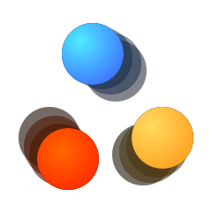

# Particle Life

A game of life using particles, instead of cells.

A JavaScript conversion, based on [Particle-Life](https://github.com/HackerPoet/Particle-Life 'Go to the repository of Particle-Life') by [HackerPoet](https://github.com/HackerPoet "Go to HackerPoet's GitHub profile").

[See it in the browser][demo]

## Todo

- [ ] Optimize rendering
  - Perhaps switch from `canvas-sketch` to a more stable and performant library (or home-grown)
- [ ] Further optimize the algorithm.
  - Use fixed-size data structures instead of arrays?
  - Allocate as much during initialization, before rendering.
  - Measure and optimize `Universe.step()` function.
  - Measure random-js and prob.js performance to ensure it is not a huge bottleneck.
- [ ] Add camera logic with zoom and tracking.

## Known Bugs

- Rendering performance is currently pretty poor (18-20 fps).
- There's no keymapping for zooming / reset, yet.

## Development

#### Scripts

- `start` — Start development. Opens browser and enables Hot reloading.
- `build` — Build distrobution-friendly files.
- `format` — Format files with [prettier](https://prettier.io/ "Go to Prettier's website").

## Contributing

Contributions are very welcome. If you've found a bug create an [issue](https://github.com/fnky/particle-life/issues 'Go to Issues') or even better, a [pull request](https://github.com/fnky/particle-life/pulls 'Go to Pull Requests').

[demo]: https://fnky.github.com/particle-life

## Credits

[HackerPoet](https://github.com/HackerPoet "HackerPoet's GitHub profile") better known as CodeParade, for the original implementation. Check out his [YouTube channel](https://www.youtube.com/channel/UCrv269YwJzuZL3dH5PCgxUw "CodeParade's YouTube channel").
